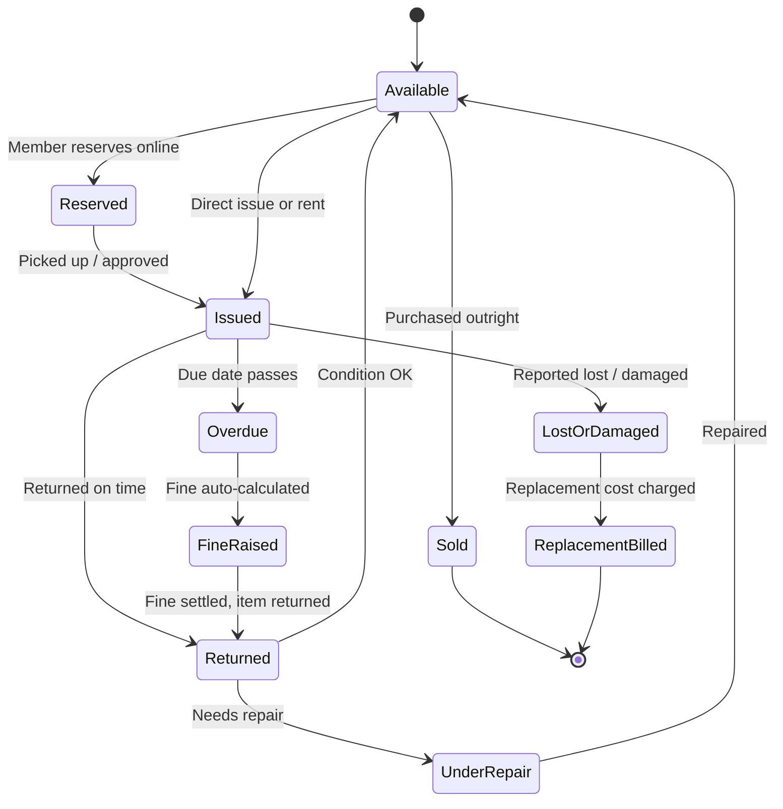

# Software Requirement Specification (SRS) & Feature Specification Document

## Feature: Library & Learning Resource Management System

**Project:** Brain Builder International — Backend API (`brainbuilder_backend`)
**Module:** `src/modules/library` (new)
**Document Version:** 1.0
**Status:** Draft — For Client Review (scope not yet frozen)
**Author:** Product / Tech Analysis (based on client brief: "dynamic library system covering books, toys and educational material, fully admin-controlled, with delegated staff access and full parent visibility")

---

## 1. Executive Summary

The client wants a library that is not limited to books — it must catalog **any physical resource** the institution lends, rents or sells: books, toys, STEM/educational kits, and other materials. The system must serve two distinct audiences from one catalog:

- **School side** — students, teachers and parents, tied to the student/class/parent records that already exist in BrainBuilder.
- **Public side** — people outside the school who register as library members and buy, rent or borrow against a paid membership.

Every policy — categories, pricing, fine rules, who is allowed to approve what — must be **admin-configurable**, not hardcoded, and the admin must be able to **delegate a slice of that control** to library staff the same way sub-admin access already works for other modules. A hard requirement from the client: **parents must see, per child, exactly what was issued/rented/bought and when**, on their existing portal.

This document proposes the feature scope and how it maps onto the existing platform. It is a specification for review, not a build-ready technical spec — pricing rules, exact category list and a few open questions (Section 17) need a client decision before implementation detail (DB schema, API contracts) is finalized.

---

## 2. Business Objective

| Objective | Description |
|-----------|--------------|
| Single dynamic catalog | Books, toys and educational material managed under one category tree, extensible without code changes. |
| Full admin control | Pricing, fine rules, borrow limits, membership plans — all settings, not constants. |
| Delegated staff access | Admin can grant a librarian/staff member a defined slice of permissions, scoped and time-bound, exactly like the existing sub-admin model. |
| Two audiences, one engine | School members (existing student/parent/teacher records) and external public members (self-registered) share the same catalog and rules engine. |
| Parent transparency | Every issue/rent/purchase against a child is visible on the parent's existing portal with full history. |
| Financial integrity | Rentals, sales and fines are tracked against a ledger per member, matching the pattern already used for fees. |
| Auditability | Every action (issue, return, price edit, fine waiver, loss report) is attributable to a user and timestamp. |

---

## 3. Scope

**In scope (Core release):**
- Catalog management for multiple item types (books, toys, educational material) under a shared category/sub-category structure.
- Title-level and copy-level (physical unit) inventory tracking.
- Three acquisition modes per title: Issue (free, time-boxed), Rent (paid, deposit-backed), Buy (outright sale).
- School membership (auto-linked to existing student/teacher/parent records) and external/public membership (self-registration, KYC, deposit).
- Delegated admin permissions for library staff.
- Parent-facing history tab per child.
- Self-service browse/reserve/pay portal for members.
- Notifications (due-soon, overdue, reservation-ready, receipts) via the existing notification module.
- Fines, deposits and payments tracked per member ledger.
- Operational and financial reports.
- Full audit trail of all actions.

**Out of scope for Core (see Section 16 — Roadmap):**
- Barcode/QR hardware scanning workflow.
- Self-checkout kiosk UI.
- Digital/e-book lending.
- Reading rewards/gamification.
- Home delivery scheduling for external members.
- Vendor/procurement management.

---

## 4. User Roles & Access

| Role | Source | Access |
|------|--------|--------|
| Super Admin | Existing `admin` role | Full control: categories, pricing, fine rules, delegation, override any transaction. |
| Librarian (Sub-admin) | Existing `sub-admin` + `Permission` model, extended | A defined subset of library permissions, optionally scoped to a branch/class and a validity window. |
| Teacher | Existing `teacher` role | Optional: reserve/issue class-set items if granted; read-only on class-wide usage otherwise. |
| Parent | Existing `parent` role | Read-only Library tab per linked child — no new login. |
| Student | Existing `student` records | Browse catalog, reserve, view own history — directly or via parent app, per client decision (Section 17). |
| External / Public Member | **New** | Self-registers, no school record required; buys/rents/borrows against a membership plan and deposit. |

---

## 5. Catalog & Inventory Design

Items are organized as **category → sub-category**, admin-defined, so new item types can be added later without a code change. Two levels of record are kept, deliberately:

- **Title** — the catalog entry (e.g. "Encyclopedia of Science, Vol. 2", or "Junior Robotics Kit").
- **Copy** — each physical unit of a title, with its own accession/barcode number, condition and status, so multiple copies of the same title can be tracked independently.

| Field | Level | Purpose |
|-------|-------|---------|
| Title, category, sub-category | Title | Catalog placement |
| Author / brand / publisher | Title | Search & filtering |
| Suitable age / grade | Title | Relevance to student |
| Allowed acquisition modes | Title | Issue-only, rentable, for sale, or a mix |
| Price, rent-per-day, deposit | Title | Feeds the payments engine |
| Accession / barcode no. | Copy | Unique physical identifier |
| Shelf / rack location | Copy | Physical retrieval |
| Condition | Copy | New → Good → Fair → Damaged → Lost |
| Status | Copy | Available, Reserved, Issued, Under repair, Retired, Sold |

Low-stock/reorder thresholds are configurable per title.

---

## 6. Membership Models

| | School member | External / public member |
|---|---|---|
| Onboarding | Auto-linked to existing student/teacher record, no separate signup | Self-registration: name, phone, address, ID proof (reuses existing document-upload flow) |
| Limits | Borrow limits/fine rules can differ by class or grade | Governed by chosen membership plan |
| Billing | Can route through the existing fee/wallet ledger, or be kept separate — admin's choice | Membership fee + refundable security deposit, paid online |
| Validity | Tied to enrollment | Plan-based (e.g. monthly/annual), admin-configurable |

---

## 7. Transaction Lifecycle

Each copy carries a status that only moves along allowed transitions — this is what prevents double-issues and unaccounted losses.

Three acquisition modes, set per title by the admin:

- **Issue** — free, time-boxed borrowing (e.g. 14 days, renewable twice), typically for school members within policy.
- **Rent** — paid, duration-based, with a refundable deposit; open to school and public members.
- **Buy** — outright sale; ownership transfers, no due date, no fine.

---

## 8. Admin Delegation & Permissions

This reuses the permission engine already in the platform (`src/modules/permission/permission.model.js` — named `Permission` documents grouped by `category`; `src/modules/subAdmin/subAdmin.model.js` — a `SubAdmin` record holding an array of `Permission` refs plus `scopeType`, `validFrom`/`validUntil`). The library module adds its own permission names to the same enum-driven system.

| Permission key | Grants |
|---|---|
| `library.catalog.manage` | Add/edit titles & copies, set pricing |
| `library.member.manage` | Approve external members, edit membership plans |
| `library.issue.manage` | Issue, return, renew, reserve |
| `library.fine.manage` | Waive, adjust or collect fines |
| `library.inventory.audit` | Run stock checks, mark lost/damaged/retired |
| `library.report.read` | View reports & dashboards, no edit rights |

Each grant can be scoped (e.g. one branch, one class group) and time-bound (a validity window), exactly like the existing sub-admin model — so temporary access (e.g. a summer-term librarian) expires automatically.

---

## 9. Parent Portal Visibility

A **Library** tab is added to the existing parent portal per linked child — no new login required.

| Column | Shows |
|---|---|
| Item | Title, cover image, category |
| Action | Issued / Rented / Bought / Returned / Renewed |
| Date | Exact date & time of the action |
| Due / return date | When expected back, or actual return date |
| Amount | Rent paid, purchase price, or fine, with receipt |
| Status | Active, overdue, returned, lost/damaged charge pending |

History is permanent (never pruned) — a parent can review everything a child has ever issued, rented or bought, the same way fee payment history already works.

---

## 10. Self-Service Member Portal

Both school and public members get browse-and-request access:

- **Browse & reserve** — search by category/age group/availability; place a hold on an unavailable item and get notified when it's back.
- **Pay & track** — pay rent, purchase price or a fine online; view own full history and current dues at any time.

---

## 11. Notifications

Runs on the existing push (`android`/`ios`/`web`) and in-app notification system (`src/modules/notification`); the library module only adds new trigger events:

- Due-soon reminder (1–2 days before due date)
- Overdue alert — to the member, and to the parent for school members
- Reservation-ready alert
- Payment/fine receipt

---

## 12. Payments & Fines

- **Fine formula is a setting**: per-day rate, grace period, maximum cap — configurable per item category.
- **Deposits** on rentals are held against the member's ledger, auto-refunded on clean return; damage/loss converts the deposit into a replacement charge.
- **School members**: library charges can post to the same ledger as tuition fees, or stay separate — admin's choice.
- **External members**: pay via online gateway at point of rent/purchase/fine settlement.

---

## 13. Reports & Dashboard

- **Operational**: overdue list, active reservations, low-stock titles, items due for repair, defaulter list by class/member.
- **Financial**: rental income, sales revenue, fines collected, deposits held, category-wise stock value — daily/monthly/custom range.

---

## 14. Multi-Branch & Audit Trail

If the library spans multiple campuses/branches, every title, copy and transaction is scoped to a branch; reports can be viewed per-branch or combined.

Every action (issue, return, price edit, fine waiver, loss report) is written to the existing audit log (`src/modules/audit`) with actor and timestamp — nothing is silently changed or deleted.

---

## 15. Integration with Existing BrainBuilder Modules

| Capability | Source |
|---|---|
| Login, roles, JWT auth | Existing `User` & auth module — unchanged |
| Delegated admin access | Existing `Permission` / `SubAdmin` models — extended with library keys |
| Parent ↔ student linkage | Existing `parent` module — Library tab added |
| Push & in-app alerts | Existing `notification` module — new trigger events |
| Action logging | Existing `audit` module — new event types |
| ID/KYC documents | Existing `document`/`upload` module — reused for external members |
| Catalog, copies, memberships, transactions, ledger | **New** — this module |

---

## 16. Roadmap (Phase 2+)

- Barcode/QR scanning for instant issue-return at the counter
- Self-checkout kiosk for students
- Reading rewards/points for on-time returns
- Home delivery/pickup scheduling for external members
- Vendor & procurement tracking for restocking
- Digital/e-book lending

---

## 17. Open Questions & Assumptions (need client input before build)

1. Does the **student** get their own login/app, or is all student-facing interaction routed through the parent app?
2. How many **branches/campuses** need separate library stock, if any?
3. Should library charges for school members post to the **same invoice** as tuition fees, or remain a separate statement?
4. What is the target **fine formula** (per-day rate, grace period, cap) — can it vary by category (book vs. toy vs. equipment)?
5. For external members, is a **security deposit** mandatory for every rental, or only above a value threshold?
6. Is a **payment gateway** already integrated elsewhere in BrainBuilder that this module should reuse, or is a new integration needed?
7. Initial **category list** to launch with (final names/hierarchy for books, toys, educational material subtypes).

---

*This is a draft specification for client review. Once Sections 3 and 17 are confirmed, this document will be extended with database schema, API contracts and implementation notes, following the same format as `docs/attendance-correction-billing-sync-srs.md`.*
